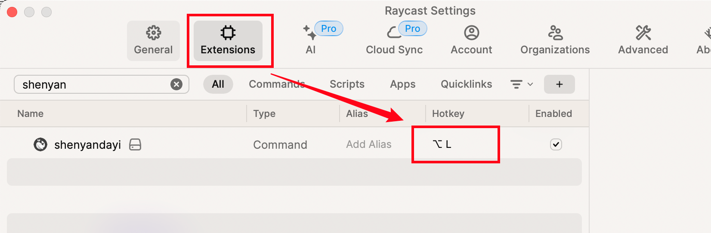

# raycast-ShenYanDaYi

一个Raycast拓展，可以根据语义查找相应的词和句子

    
    

<video src="./assets/screenCapture.mov" controls width="640" autoplay loop muted>
Your browser does not support the <code>video</code> element.
</video>

## 动机
【<a href="https://shenyandayi.com">深言达意</a>】是一款可根据模糊描述，找词找句的智能写作工具。产品基于强大的语言理解和算法能力，助你在深邃词海中快速找到更恰切的表达，妙笔生花，灵感迸发。

然而，由于每次使用都需要打开网站查找再复制，不甚趁手，如果找词找句相关功能可以不用打开网页即随来随走，将会为写作带来极大便利。【<a href="https://raycast.com/">Raycast</a>】提供了插件能力，将以上想法变成一个桌面工具不再是难题，因此便有了本项目。<a href="https://github.com/WenHao0804/raycast-shenyandayi">raycast-ShenYanDaYi</a>提供了【<a href="https://shenyandayi.com">深言达意</a>】找词找句的核心功能，而无过多复杂的界面，按快捷键即可呼出，用完即走。
## 安装
目前，你需要下载此项目的源码，再以raycast本地插件形式安装。

你需要先安装[Node.js](https://nodejs.org) 和 [npm](https://www.npmjs.com/package/npm)。随后：

1. 下载源码：`git clone https://github.com/WenHao0804/raycast-shenyandayi`
2. 进入目录：`cd raycast-shenyandayi`
3. 安装依赖：`npm install`
4. 编译：`npm run build`
5. 进入Raycast，执行安装拓展(import extension)，并选择此项目根目录

安装拓展后，建议为shenyandayi插件添加自定义的快捷键，方便快速调用。比如`opt + L`或任何你认为方便的快捷键：

## 功能
### 找词找句
在raycast中进入shenyandayi插件，直接输入想要查找的内容并回车即可。

如果需要在找词时按字数过滤，则需要在query后按空格，再添加过滤条件。目前支持三种条件：
1. `纯数字`：只查找当前字数的词
2. `<数字`：查找比当前字数小的词
3. `>数字`：查找比当前字数大的词

### 自动获取选中内容
用光标选中文字，再进入shenyandayi插件，即可自动填充输入栏。

## 致谢
- 深言达意官网：<a href="https://shenyandayi.com/">https://shenyandayi.com/</a>

## 未来计划
- [ ] 词释义
- [ ] 查作者
- [ ] 查作品
- [ ] 查询条件配置页面(类别、词性、语种...)

## License

MIT License